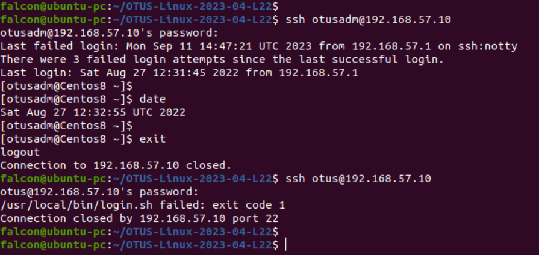

### OTUS-Linux-2023-04-L22 | PAM

1. Созданы пользователи *otusadm* и *otus*. Создана группа admin, в неё добавлены пользователи: otusadm,root и vagrant.
	> [root@Centos8 yum.repos.d]# cat /etc/group | grep -e ^admin  
	> min:x:1003:otusadm,root,vagrant

2. Создан скрипт для анализа даты и пользователя, который будет логиниться по ssh:

		#!/bin/bash
		if [ $(date +%a) = "Sat" ] || [ $(date +%a) = "Sun" ]; then
 		if getent group admin | grep -qw "$PAM_USER"; then
    	    exit 0
    	  else
    	    exit 1
    	fi
  		else
    	exit 0
		fi

3. Настройки PAM для sshd следующие:
	
[root@Centos8 etc]# cat /etc/pam.d/sshd 
	>#%PAM-1.0
	>auth       substack     password-auth
	>auth	   include      postlogin
	>account    required     pam_nologin.so
	>**account	   required		pam_exec.so /usr/local/bin/login.sh**
	>account    include      password-auth
	>-password   include      password-auth
	># pam_selinux.so close should be the first session rule
	>session    required     pam_selinux.so close
	>session    required     pam_loginuid.so
	># pam_selinux.so open should only be followed by sessions to be executed in the user context
	>session    required     pam_selinux.so open env_params
	>session    required     pam_namespace.so
	>session    optional     pam_keyinit.so force revoke
	>session    optional     pam_motd.so
	>session    include      password-auth
	>session    include      postlogin
	>[root@Centos8 etc]# 

4. Проверям что пользователь otusadm может подключиться по SSH в субботу, а пользователь otus - нет.

